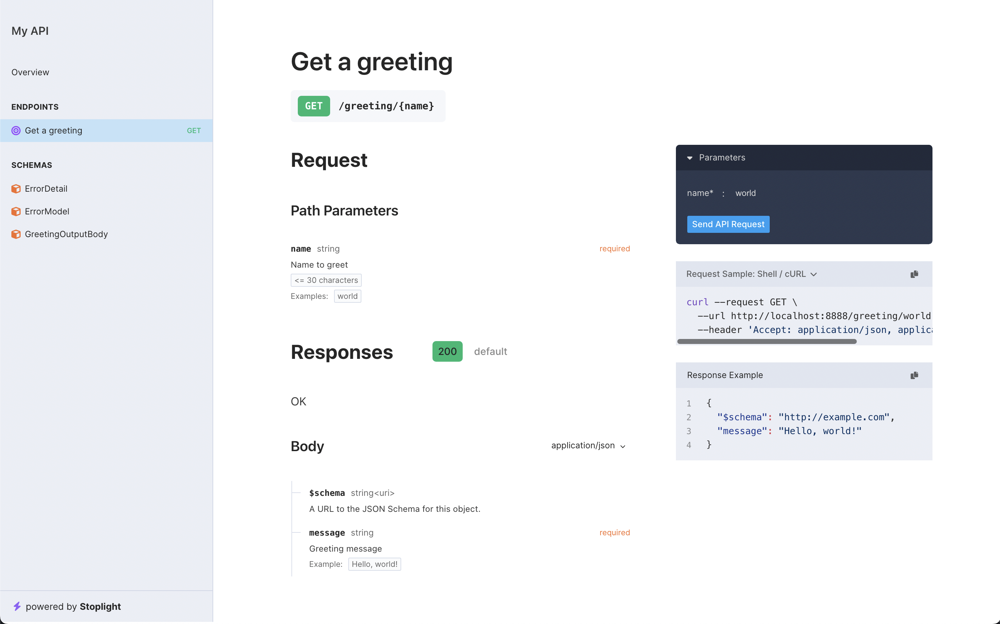

# Your First API

Let's build a simple API that greets people. We will take the person's name as a URL path parameter and respond with a JSON body containing a greeting message to that person. Here's the high-level API design:

```title="API Design"
Request:
GET /greeting/{name}

Response:
{
	"message": "Hello, {name}!"
}
```

## Request Input

Start by making a new file `main.go` and adding the greet operation's request input model:

```go title="main.go" linenums="1"
package main

// GreetingInput represents the greeting operation request.
type GreetingInput struct {
	Name string `path:"name" maxLength:"30" example:"world" doc:"Name to greet"`
}
```

The `path` tag tells Huma that this field should be read from the URL path, which we will use when registering the operation. The `maxLength` tag tells Huma that the name should be no longer than 30 characters.

You should now have a directory structure that looks like:

```title="Directory Structure"
my-api/
  |-- go.mod
  |-- go.sum
	|-- main.go
```

## Response Output

Next, let's add the response output model, which has a body with a `message` field for the greeting message.

```go title="main.go" linenums="1" hl_lines="8-13"
package main

// GreetingInput represents the greeting operation request.
type GreetingInput struct {
	Name string `path:"name" maxLength:"30" example:"world" doc:"Name to greet"`
}

// GreetingOutput represents the greeting operation response.
type GreetingOutput struct {
	Body struct {
		Message string `json:"message" example:"Hello, world!" doc:"Greeting message"`
	}
}
```

Requests and responses may define a field `Body` which will be used to marshal or unmarshal the request or response body.

## Router & API

Let's create a router, which will handle getting incoming requests to the correct operation handler, and a new API instance where we can register our operation.

```go title="main.go" linenums="1" hl_lines="3-9 23-32"
package main

import (
	"net/http"

	"github.com/danielgtaylor/huma/v2"
	"github.com/danielgtaylor/huma/v2/adapters/humachi"
	"github.com/go-chi/chi/v5"
)

// GreetingInput represents the greeting operation request.
type GreetingInput struct {
	Name string `path:"name" maxLength:"30" example:"world" doc:"Name to greet"`
}

// GreetingOutput represents the greeting operation response.
type GreetingOutput struct {
	Body struct {
		Message string `json:"message" example:"Hello, world!" doc:"Greeting message"`
	}
}

func main() {
	// Create a new router & API
	router := chi.NewMux()
	api := humachi.New(router, huma.DefaultConfig("My API", "1.0.0"))

	// TODO: Register operations...

	// Start the server!
	http.ListenAndServe("127.0.0.1:8888", router)
}
```

## Operation

Register the operation with the Huma API instance, including how it maps to a URL and some human-friendly documentation. The handler function will take in the `GreetingInput` and return the `GreetingOutput` models we built above.

```go title="main.go" linenums="1" hl_lines="4-5 30-40"
package main

import (
	"context"
	"fmt"
	"net/http"

	"github.com/danielgtaylor/huma/v2"
	"github.com/danielgtaylor/huma/v2/adapters/humachi"
	"github.com/go-chi/chi/v5"
)

// GreetingInput represents the greeting operation request.
type GreetingInput struct {
	Name string `path:"name" maxLength:"30" example:"world" doc:"Name to greet"`
}

// GreetingOutput represents the greeting operation response.
type GreetingOutput struct {
	Body struct {
		Message string `json:"message" example:"Hello, world!" doc:"Greeting message"`
	}
}

func main() {
	// Create a new router & API
	router := chi.NewMux()
	api := humachi.New(router, huma.DefaultConfig("My API", "1.0.0"))

	// Register GET /greeting/{name}
	huma.Register(api, huma.Operation{
		OperationID: "get-greeting",
		Summary:     "Get a greeting",
		Method:      http.MethodGet,
		Path:        "/greeting/{name}",
	}, func(ctx context.Context, input *GreetingInput) (*GreetingOutput, error) {
		resp := &GreetingOutput{}
		resp.Body.Message = fmt.Sprintf("Hello, %s!", input.Name)
		return resp, nil
	})

	// Start the server!
	http.ListenAndServe("127.0.0.1:8888", router)
}
```

Congratulations! This is a fully functional Huma API!

## Calling the API

Let's test it out! Start the server:

```bash
$ go run .
```

In another terminal window, make a request to the API using [Restish](../tutorial/cli-client.md#install-restish) or curl:

=== "Restish"

    {{ asciinema("../../terminal/hello.cast", rows="13") }}

=== "Curl"

    ```sh title="Terminal"
    # Get a greeting from the API
    $ curl http://localhost:8888/greeting/world
    ```

!!! info "Schemas"

    You can ignore the `Link` header and `$schema` field for now. These are added automatically by Huma to help clients discover information about the API, and to provide things like auto-completion and linting in editors.

## API Documentation

Go to [http://localhost:8888/docs](http://localhost:8888/docs) to see the interactive generated documentation for the API. It should look something like this:

{ loading=lazy }

Using the panel at the top right of the documentation page you can send a request to the API and see the response.

These docs are generated from the OpenAPI specification, which is available at [http://localhost:8888/openapi.json](http://localhost:8888/openapi.json). You can use this file to generate documentation, client libraries, commandline clients, mock servers, and more.

## Review

Congratulations! You just learned:

-   Creating Huma input and output models
-   Creating a Golang REST API with Huma
-   How to make requests to the API
-   How to view the generated documentation

Read on to learn how to level up your API with even more features.
